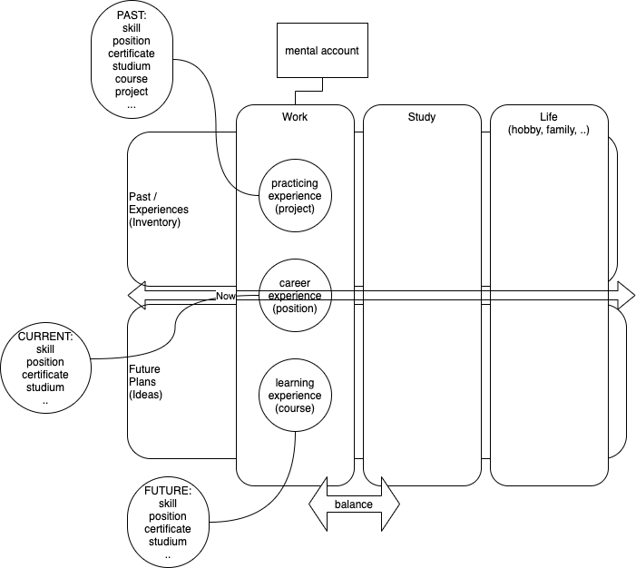

# Skill Garden

Skill Garden Coaches users to enforce "Get Better Mindset" by setting goals, tracking progress towards them and recording them as skills or accomlishments. 

Example: 

Career on information technology can be seen as set of learning challenges. Learning challanges can be modelled as goals and accomplished using tools like self paced courses. When planned activity dates (now = due date of learning task) it might be taken in to past archievements if user confirms it done. Past achievements can be seen as inventory and short and long term plans as career goals. 

Vision:

This could be mobile or web system with broad user base like "everyone in world" or "any linkedin user". System could be linked to HR systems and used to facilitate careen planning and skill inventory, but it could be also used individually by single person. 

CV generator for markdown template is possible extension point, which could make such system interesting for broader community.

## Conceptual model

Note: Mental accounts like "heavy rocker" or "work" are defined by user, but there might be set of defaults offered.

## Tools

### Mobile UI & Cloud

- Flutter (= Skia + Dart)
- Aws Amplify https://aws.amazon.com/blogs/mobile/announcing-aws-amplify-flutter-developer-preview/

### mobile paas 

- aws amplify & aws cognito & ..
- example: https://github.com/nikkijuk/aws-image-gallery

### user identity

- Linkedin as identity provider
- auth0 as technology connecting linkedin to apps https://auth0.com/docs/connections/social/linkedin
- aws cognito as cloud service https://aws.amazon.com/premiumsupport/knowledge-center/cognito-linkedin-auth0-social-idp/

### export / import

- users can sync their data with remote sources like own employer
- manual sync or automatic sync
- example: Company X has trust relationship to person Y and gets automatic synced information 

### Code editing

- Visual Studio Code
- Android Studio

### Diagrams

- Draw.io
- Plant UML

